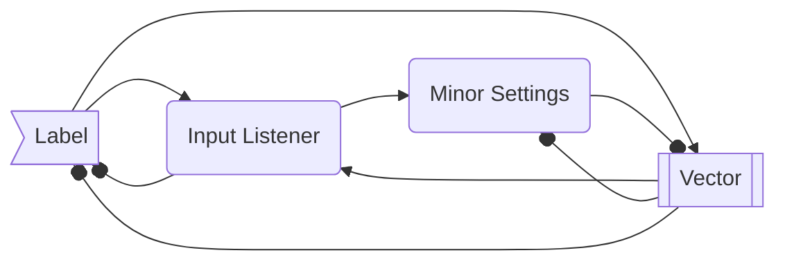

# Summary
Proposal to extend Input API functionality in a cross-platform and multi-input-device environment.

# Contributors
- Lumi (@Lumi2021)

# Current Status
- [x] Proposed
- [ ] Discussed with Working Group
- [ ] Approved
- [ ] Implemented

# Design Decisions
- Abstracts the complex interface between the user and a lot of lines of code that are necessary to 

# Input Maps

## Presentation
Input maps are designed to be easier for the developer and the end-user to handle actions with more than one input.
It's perfect for cross-platform programs, and games an example, because it can reduce the need for work on complex abstractions to handle different types of inputs and their resulting values, like floats, booleans or vectors that can come from the different features of mice, keyboards or controllers. This is a pseudocode example of what the Input Map system solves:

## Usage Examples
Without inputMaps:
```cs
inputContext.Update();

private Dictionary<KeyName, bool> keyMap = new Dictionary<KeyName, bool>{
    KeyName.W=false,
    KeyName.A=false,
    KeyName.S=false,
    KeyName.D=false,
};

inputContext.Keyboards.KeyDown += @event {
    if (keyMap.IncludeKey(@event.Key))
    {
        keymap[@event.Key] = true;
        CalculateKeyboardMovement();
    }
};
inputContext.Keyboards.KeyUp += @event {
    if (keyMap.IncludeKey(@event.Key))
    {
        keymap[@event.Key] = false;
        CalculateKeyboardMovement();
    }
};

private CalculateKeyboardMovement()
{
    Vector2D<float> inputDir = new Vector2D<float>();

    if (keyMap[Keyname.W])
        inputDir.y += 1;
    if (keyMap[Keyname.S])
        inputDir.y -= 1;
    if (keyMap[Keyname.A])
        inputDir.x -= 1;
    if (keyMap[Keyname.D])
        inputDir.x += 1;

    Move(@event.inputDir);
}

inputContext.Gamepads.ThumbstickMove += @event => {Move(@event.Value)};
inputContext.Joysticks.AxisMove += @event => {Move(@event.Value)};

private Move(Vector2D<float> direction)
{
    // Code for movement here
}
```

With inputMaps:
```cs
inputContext.Update();

// This single line get rid of all the lot lines used before!
inputContext.Map.GetAction("Move").Axis += @event => {Move(@event.Value)};

private Move(Vector2D<float> direction)
{
    // Code for movement here
}
```

## Describing The System
Each InputContext has one reference to an InputMap.
This is how the InputMap class should look like:
```cs
public partial class InputMap
{
    public InputContext? context { get; set; };
    public InputMapAction GetAction(string name);
    public InputMapAction this[string name];

    public void AddAction(InputMapAction action, string name);
    public void RemoveAction(string name);

    public static InputMap Load(string path);
    public static string Serialize(InputMap source);
}
```

`GetAction` method is the main entry point of the system. It allows the user to get a mapped action by its configured name.

> **obs:** This section needs some improvements to include the binded keys and their configurations
```cs
public partial abstract class InputMapAction {}
public partial class SingleInputMapAction : InputMapAction
{
    public bool IsPressed { get; }
    public float Value { get; }
}
public partial class VectorInputMapAction<VecT> : InputMapAction
{
    public VecT Value { get; }
}
```

The `SingleInputMapAction` is a class that manipulates only a single value input. This can be the case of a button or a key on the keyboard. `IsPressed` will return `true` when the action is being made, and `false` in case of not.

The `VectorInputMapAction` is a class that manipulates all the vectorial returning types, like joysticks or buttons configured to return a vector. `Value` will be the resulting calculated vector of the actions and `VecT`, the type of the vector.

### Changing During Runtime
In the case of the necessity of making some change during the runtime, the developer should manually get the desired action using `GetAction` or the indexing operator and manually change the binding and configurated data on it.
If some saving is needed, it's possible to serialize the inputmap using the static method `InputMap.Serialize()` and save the returned string in the right place on the hard disk.

### Multiplayer and Different Devices
In the case of the necessity of handling the input of different devices as different actions, the developer needs to manually duplicate and turn then unique actions, needing also to filtrate them to the correct input device.

## Configuration and saving
The input map system's save system is one of the most important to it working. It helps to make the configuration easier and faster.

Instead of needing to hardcode all the actions, the user should create a file with the `.imap` extension. This is an example of the syntax of the map system's saved data:
```
"jump":
    - KeyName.Up
    - JoystickButton.DPadUp

"throw":
- KeyName.Q
- JoystickButton.DPadLeft

"move":
    - Vector2D [
        -KeyName.Down
        -KeyName.Up
        -KeyName.Left
        -KeyName.Right
    ]
        * value (0.5)

    - Vector2D [
        -KeyName.Down
        -KeyName.Up
        -KeyName.Left
        -KeyName.Right
    ] --Shift
        * value (1)

    - Joystick.Axis
        * range (0.5, 1)
```

The main syntax may somewhat resemble YAML, but it's much more simple and easy to parse.

The main structure is based on a list, with its main feature having line separation as the main way to separate the information. Also, the parsing is based on a finite-state model. The last data set will receive the next configurations until a higher level of information is set. indentation or left padding is completely optional.

The label is written inside of quotes ("") and delimited by a colon (:). This starts a new `InputMapAction`.
each new input is declared with a minus sign (-) and a space. After that, the name of the correct enum and the correct input.

After the Input action, some minor settings can be added. minor settings are declared with an asterisk (*) followed by a space and the name of the targeted value. After that, the values should be put inside parentheses (`()`) in the right order specified in the documentation.

The input system can easily structure simple inputs to return complex vectors. After the minus sign, it's possible to choose a vector type to receive (`Vector2D`, `Vector3D` or `Vector4D`) and the two inputs that will match each axis, respectively, first the negative and after the positive.

some examples are:
```
- Vector2D [
    - keyToLeft
    - keyToRight
    - KeyToDown
    - KeyToUp
]
- Vector3D [
    - keyToLeft
    - keyToRight
    - KeyToDown
    - KeyToUp
    - KeyToBack
    -KeyToFront
]
```

Comments are allowed in these files by prefixing them with a hash symbol (#). All the content after it is a comment until the line ends.

To load an `InputMap` from a file, the static method `Load` should be used. If the map is edited at runtime, it's possible to get the serialized class with the changes using the static method `Serialise`.

### State Machine

`-->` - Higher than
`--o` - Lower than



The state will be set until a higher state is declared. In this way, the user will continue configuring the last InputMapAction until the parser finds a new InputMapAction. this InputMapAction will now be the one being configurated. If the user is declaring a minor setting, they just need to start a new InputMapAction to exit the current, instead of needing to get out of its scope.

## Input Map File Documentation
**Warning:** This documentation can (and will) have changes in the future!

### Flags
*Flags* can be applied to an input to identify special keys being pressed with this key.
Flags can be accumulated and are always prefixed by double minus characters (--).
(flags are case sensitive)

| aplied case | flag     |
|:------------|:---------|
| Keyboard    | --Shift  |
| Keyboard    | --LShift |
| Keyboard    | --RShift |
| Keyboard    | --Alt    |
| Keyboard    | --AltGr  |
| Keyboard    | --Fn     |
| Keyboard    | --Ctrl   |
| Keyboard    | --LCtrl  |
| Keyboard    | --RCtrl  |

### Minor Settings
*Minor settings* are applied to filter, pre-operate or set an expected returned value of some action. These actions depend on what's the type of the returning value, what's the device type or ID that the input comes from and more. Here is the main list of minor configurations:

| aplied case | setting name | Description | parameters |
|:------------|:-------------|:------------|:----------:|
|    Any      |   DeviceId   | Considerate the event only when the device that fired it have the same configurated ID | Value (System.Int32) |
|    Any      |   Value      | Set a default modular value to be the returned numeric value of the action. If used on a vector, will be multiplyed by -1 when the input is configurated to a negative direction | Value (System.Single) |
|    Vector   |   Range      | Set a specific modular range to considerate the input. the result will be normalised between the range | Min (System.Single), Max (System.Single) |