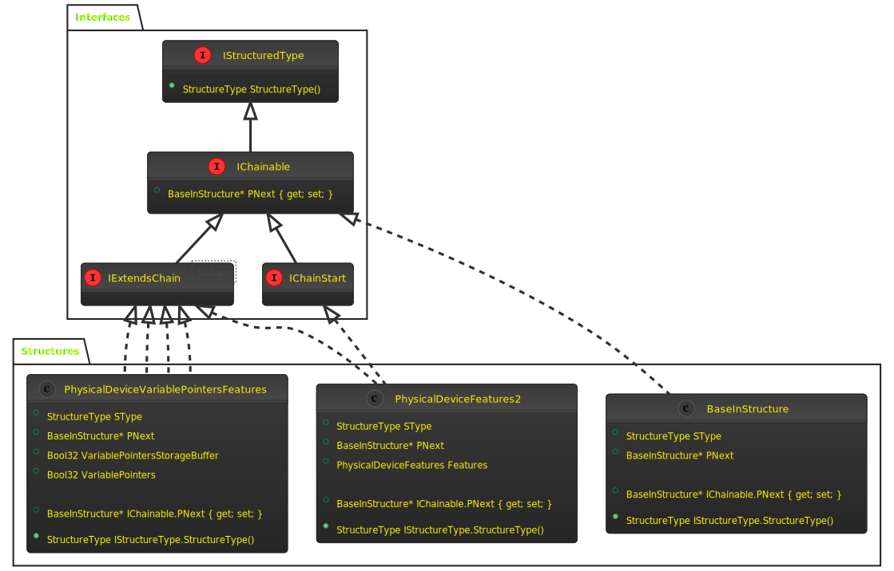

# Vulkan Chaining

[Table of Contents](overview.md#table-of-contents)
- [BaseInStructure](vulkan.md#baseinstructure)
- [IChainable](vulkan.md#ichainable)
- [IStructureType](vulkan.md#istructuredtype)
- [IExtendsChain&lt;TChain&gt;](vulkan.md#iextendschainlttchaingt)
- [IChainStart](vulkan.md#ichainstart)
- ['Any' Overloads](vulkan.md#any-overloads)
- [Class Diagram](vulkan.md#class-diagram)

## BaseInStructure

The Vulkan Specification provides
a [machine-readable XML version](https://raw.githubusercontent.com/KhronosGroup/Vulkan-Docs/main/xml/vk.xml) of its API
which is used by Silk.NET's `BuildTools` to automatically generate the API in the `Silk.NET.Vulkan` namespace. Each
structure type, used by the API, is clearly defined in the document. Two of those types are `VkBaseOutStructure`
and `VkBaseInStructure`, the latter of which maps to
the [BaseInStructure](../../src/Vulkan/Silk.NET.Vulkan/Structs/BaseInStructure.gen.cs) type in Silk.NET, which contains
2 fields:

```csharp
public unsafe partial struct BaseInStructure : IChainable
{
    public StructureType SType;
    public BaseInStructure* PNext;
    ... // Abbreviated for clarity
}
```

This structure represents a 'base type' of all 'chainable' structures in the Vulkan API; that is, structures that can be
chained together in a
[Singly Linked List](https://en.wikipedia.org/wiki/Linked_list) using the `PNext` field. Unfortunately, plain old C#
structs cannot extend each other, so we indicate this relation using the `IChainable` interface, which guarantees that
any unmanaged structure that implements it has the same two fields in the first two positions. Most importantly this
means that we can use `BaseInStructure*` as the type for `PNext` instead of just `void*`, and so can access
the `StructureType` of each item in the chain as well as the next item.

## IChainable

As mentioned above, the `IChainable` interface acts as a guarantee that the first two fields of an unmanaged struct
contain the
`StructureType` in a field called `SType` and a pointer to the next item in a chain (usually as `void*`, but
alternatively as `BaseInStructure*` as above, or even `BaseOutStructure`) in a field called `PNext`. C# interfaces
cannot specify fields though, so this guarantee is enforced during generation. It is important, therefore, that you do
not add the interface to your own types, unless you are very clear on the implications and make the same guarantees.

The interface is defined [here](../../src/Vulkan/Silk.NET.Vulkan/IChainable.cs):

```csharp
/// <summary>
/// Base interface for any struct that has can set the next value.
/// </summary>
/// <remarks><para>Note that any structure marked <see cref="IChainable"/> must start with a
/// <see cref="StructureType"/> and a <c>void*</c> field, in that order. This is so that a pointer to it can be coerced
/// to a pointer to a <see cref="BaseInStructure"/>.</para></remarks>
public interface IChainable : IStructuredType
{
    /// <summary>
    /// Points to the next <see cref="IChainable"/> in this chain, if any; otherwise <see langword="null"/>.
    /// </summary>
    unsafe BaseInStructure* PNext { get; set; }
}
```

As you can see, it _does_ specify a Property `PNext`, which we implement explicitly on any structure that implements the
interface, to avoid confusion with the equivalent field. e.g.:

```csharp
public void* PNext;

/// <inheritdoc />
unsafe BaseInStructure* IChainable.PNext
{
    get => (BaseInStructure*) PNext;
    set => PNext = value;
}
```

## IStructuredType

You may also note that `IChainable` extends `IStructuredType` which is
defined [here](../../src/Vulkan/Silk.NET.Vulkan/IStructuredType.cs):

```csharp
/// <summary>
/// Base interface for any struct that has a <see cref="StructureType"/> field called `SType`, that must be correctly
/// set when passing into the Vulkan API.
/// </summary>
public interface IStructuredType
{
    /// <summary>
    /// Gets the structured type's <see cref="Vulkan.StructureType"/> enum value.
    /// </summary>
    /// <remarks>
    /// Retrieving the <see cref="Vulkan.StructureType"/> also ensures it is set to the correct value (if any).
    /// </remarks>
    StructureType StructureType();
}
```

Although this is currently never implemented directly (as all such structures in Vulkan are [Chainable](#ichainable)),
it is split out from `IChainable` for clarity.

Notice that `StructureType()` is a method rather than a property. This is because it not only returns
the `StructureType` for the current structure, it also ensures it is correctly set. This is because C# structures do not
have a way to force field initialisation. This method is used by Silk.NETs chaining system to ensure the `StructureType`
is always set correctly, and is implemented automatically, e.g:

```csharp
[NativeName("Name", "VkDeviceCreateInfo")]
public unsafe partial struct DeviceCreateInfo : IChainStart
{
    ...
    /// <inheritdoc />
    StructureType IStructuredType.StructureType()
    {
        return SType = StructureType.DeviceCreateInfo; // Assigns correct value AND returns it
    }
    ...
}
```

## IExtendsChain&lt;TChain&gt;

For _some_ chainable structures,
the [Vulkan Specification](https://raw.githubusercontent.com/KhronosGroup/Vulkan-Docs/main/xml/vk.xml) goes further and
specifies which chains the structure can be used in. For example, take the `VkPhysicalDeviceVariablePointersFeatures`
structure, which maps
to [`PhysicalDeviceVariablePointersFeatures`](../../src/Vulkan/Silk.NET.Vulkan/Structs/PhysicalDeviceVariablePointersFeatures.gen.cs)
. It is defined in the specification as:

```xml

<type category="struct"
      name="VkPhysicalDeviceVariablePointersFeatures"
      structextends="VkPhysicalDeviceFeatures2,VkDeviceCreateInfo">
    ...
</type>
```

Which, `BuildTools` converts to:

```csharp
[NativeName("Name", "VkPhysicalDeviceVariablePointersFeatures")]
[NativeName("Aliases", "VkPhysicalDeviceVariablePointersFeaturesKHR, VkPhysicalDeviceVariablePointerFeaturesKHR, VkPhysicalDeviceVariablePointerFeatures")]
public unsafe partial struct PhysicalDeviceVariablePointersFeatures : 
    IExtendsChain<PhysicalDeviceFeatures2>, 
    IExtendsChain<PhysicalDeviceFeatures2KHR>, 
    IExtendsChain<DeviceCreateInfo>
{ ... }
```

As you can see, it _doesn't_ seem to implement `IChainable`, instead it implements `IExtendsChain<>` 3 times. The first
part is easy enough to understand when we see the definition
of `IExtendsChain` [here](../../src/Vulkan/Silk.NET.Vulkan/IExtendsChain.cs):

```csharp
/// <summary>
/// Marks a <see cref="IChainable">chainable</see> struct indicating which <see cref="IChainStart">chain</see> this type
/// extends.
/// </summary>
/// <typeparam name="TChain">A chain start structure.</typeparam>
public interface IExtendsChain<out TChain> : IChainable
    where TChain : unmanaged, IChainable
{
}
```

Clearly, `IExtendsChain` implements `IChainable` and doesn't add anything, acting instead as additional metadata for the
structure, by indicating which chains the structure is valid on. This is pivotal to `Silk.NET`'s chaining system,
allowing it to enforce such constraints at compile time.

But where does the `IExtendsChain<PhysicalDeviceFeatures2KHR>` come from? As the API only lists 2 structures in
the `structextends` attribute? Well a clue can be found in the `PhysicalDeviceFeatures2`
structure [here](../../src/Vulkan/Silk.NET.Vulkan/Structs/PhysicalDeviceFeatures2.gen.cs):

```csharp
[NativeName("Name", "VkPhysicalDeviceFeatures2")]
[NativeName("Aliases", "VkPhysicalDeviceFeatures2KHR")]
public unsafe partial struct PhysicalDeviceFeatures2 : IChainStart, IExtendsChain<DeviceCreateInfo>
{ ... }
```

As you can see this indicates that the specification defines an alias for `VkPhysicalDeviceFeatures2`
called `VkPhysicalDeviceFeatures2KHR`, which maps to the `PhysicalDeviceFeatures2KHR` structure
found [here](../../src/Vulkan/Silk.NET.Vulkan/Structs/PhysicalDeviceFeatures2KHR.gen.cs).

## IChainStart

From `PhysicalDeviceFeatures2` we can see another new interface called `IChainStart`, similar to
`IExtendsChain<TChain>`, it also implements `IChainable` and is
defined [here](../../src/Vulkan/Silk.NET.Vulkan/IChainStart.cs):

```csharp
/// <summary>
/// Marks a <see cref="IChainable">chainable</see> struct as being allowed at the start of a chain.
/// </summary>
/// <remarks><para>Any <see cref="IChainStart"/> will have a corresponding static `BaseInStructure(out var chain)`
/// convenience method.</para></remarks>
public interface IChainStart : IChainable
{
}
```

This allows us to specify which structures can be used as the start of a chain.

## 'Any' Overloads

However, not all possible chains are defined explicitly, so throughout Silk.NET's chaining system we support `*Any`
overloads, which relax the generic constraints. That is, instead of requiring `IChainStart` types at the head/start of a
chain, and the corresponding `IExtendsChain<TChain>` types throughout the chain), `*Any` methods only
require `IChainable` structures throughout.

## Class Diagram

The above structures can be visualized below:

