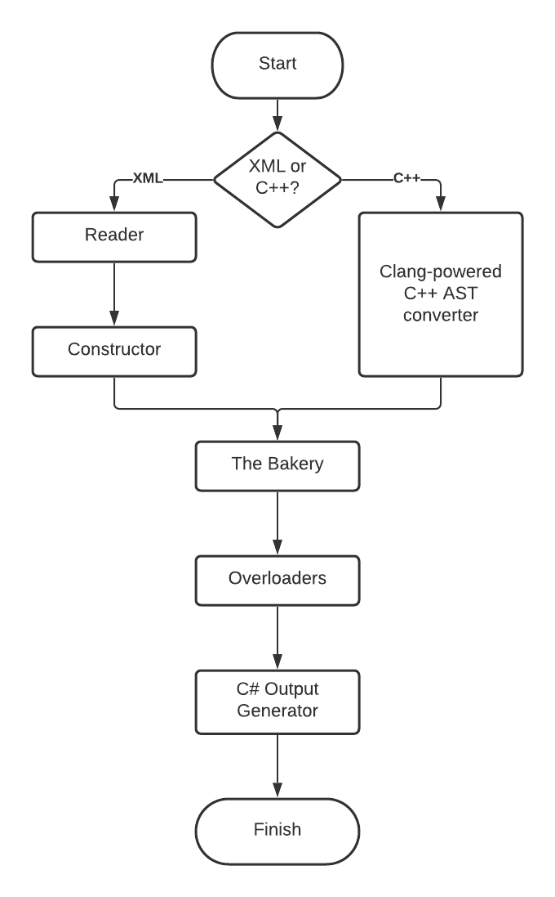

---
{
    "TableOfContents": {
        "Name": "Generating an entire library: An introduction to BuildTools",
        "Url": "buildtools.html",
        "Metadata": {
            "AuthorGitHub": "Perksey",
            "DateTimeWritten": "12/02/2021 15:10",
            "PreviewImage": "images/blog/feb-2021/sbt.png"
        }
    }
}
---

# Generating an entire library: An introduction to BuildTools
We've been doing a lot of blog posts on one of our new and shiny components of Silk.NET, our source generator SilkTouch, however you may have heard that there's another generator working in the shadows to get all these bindings going. This is something we called BuildTools. Admittedly, the name isn't very catchy, but it does a lot of work for us and BuildTools-generated code makes up ~95% of the entire Silk.NET codebase and has existed since the earliest days of Silk.NET.

So, what gives? Back when we were starting development of Silk.NET, we knew for a fact that we wanted to stay up-to-date, always. That's why we have the monthly updates. The fact of the matter is the libraries we're binding to change all the time, and we don't want to be left behind. We needed to find some way to ensure that our bindings remain up-to-date, but without labouring away to do so. This is where BuildTools comes in.

Here's a rough overview of the workflow that BuildTools undertakes:

<p class="text-center">
    
</p>

BuildTools operates in many different ways depending on whether you're binding to a Khronos API or a C++ API. Today we'll only talk about the former. In that scenario, BuildTools is split up into 5 different stages. These are:

## Reader

Code for your reference: [OpenGLReader.cs](https://github.com/dotnet/Silk.NET/blob/main/src/Core/Silk.NET.BuildTools/Converters/Readers/OpenGLReader.cs)

This phase is the very first step of a Silk.NET monthly update. The Khronos Group are kind enough to give us a big XML document containing all the latest functions, enums, and structs, like so:

```xml
<command>
    <proto>void <name>glDrawArrays</name></proto>
    <param group="PrimitiveType"><ptype>GLenum</ptype> <name>mode</name></param>
    <param><ptype>GLint</ptype> <name>first</name></param>
    <param><ptype>GLsizei</ptype> <name>count</name></param>
    <glx type="render" opcode="193"/>
</command>
```

For the most part, this XML file is very easily parsed. There are some places, like with the function pointer signatures, that don't make it easy but for those cases we just ship hand-written stuff with our bindings.

If you'd like to have a look at [this file](https://raw.githubusercontent.com/KhronosGroup/OpenGL-Registry/master/xml/gl.xml) yourself, it's in [the official OpenGL registry](https://github.com/KhronosGroup/OpenGL-Registry). It's certainly a behemoth, but because it gives us all of the information on OpenGL we can start to create parsed functions and enums.

As we go, we also assign certain metadata to those functions and enums such that we have something to go on in the next step, such as categories (e.g. GL_VERISON_4_3, or GL_EXT_direct_state_access), an extension name (or "Core" if the element didn't come from an extension), and version numbers.

The reader stage spits out those in Function and Enum objects, which are common APIs that BuildTools uses throughout and maps, for the most part, 1:1 to the Binder JSON Interchange Format.

## Constructor
Code for your reference: [OpenGLConstructor.cs](https://github.com/dotnet/Silk.NET/blob/main/src/Core/Silk.NET.BuildTools/Converters/Constructors/OpenGLConstructor.cs)

Right now we're in the situation where we have lots of Function and Enum objects flying around in the wild, but nothing really tying them together. This is where the constructor comes in.

The constructor takes all those Function and Enum objects, looks at the metadata within them, and writes them to a Profile object, which contains the project structure which the resultant C# code ends up taking on, as well as all the Function and Enum objects. There are many more objects that are added to the Binder JSON, but for sake of simplicitly I'll leave them out of this post.

Each version and API has its own Profile object which are created by the ProfileConverter class that tie the Reader and Constructor stages together. Let's look at a snippet of how this is done: 
```cs
var profiles = enums.Select(x => (x.ProfileName, x.ProfileVersion))
    .Concat(functions.Select(x => (x.ProfileName, x.ProfileVersion)))
    .Distinct()
    .Select(x => CreateBlankProfile(x.ProfileName, x.ProfileVersion));
```

Pretty self explanatory. `CreateBlankProfile` returns a Profile object with sensible defaults given the profile name and version.

The constructor is then called for every single one of those blank profiles, and is responsible for writing functions to the correct profile, and creating the aforementioned project structure as it deems fit.

Awesome, we're done with the XML-specific stuff! By now the entirety of the Binder JSON for each profile name and version is constructed using our regular .NET objects. That function we saw earlier? Here's what that looks like now:


<a class="btn btn-primary" data-toggle="collapse" href="#binderjson" role="button" aria-expanded="false" aria-controls="binderjson">
    glDrawArrays' Binder JSON (Click to expand)
</a>

<div class="collapse" id="binderjson">
    <pre>
        <code class="language-json">
{
  "Name": "DrawArrays",
  "ReturnType": {
    "IndirectionLevels": 0,
    "ArrayDimensions": 0,
    "Name": "void",
    "OriginalName": "void",
    "OriginalGroup": null,
    "OriginalClass": null,
    "GenericTypes": [],
    "IsByRef": false,
    "IsOut": false,
    "IsIn": false,
    "IsThis": false,
    "FunctionPointerSignature": null,
    "IsGenericTypeParameterReference": false
  },
  "NativeName": "glDrawArrays",
  "Parameters": [
    {
      "Name": "mode",
      "Type": {
        "IndirectionLevels": 0,
        "ArrayDimensions": 0,
        "Name": "GLEnum",
        "OriginalName": "GLenum",
        "OriginalGroup": "PrimitiveType",
        "OriginalClass": null,
        "GenericTypes": [],
        "IsByRef": false,
        "IsOut": false,
        "IsIn": false,
        "IsThis": false,
        "FunctionPointerSignature": null,
        "IsGenericTypeParameterReference": false
      },
      "Count": null,
      "Flow": 1,
      "Attributes": []
    },
    {
      "Name": "first",
      "Type": {
        "IndirectionLevels": 0,
        "ArrayDimensions": 0,
        "Name": "int",
        "OriginalName": "GLint",
        "OriginalGroup": null,
        "OriginalClass": null,
        "GenericTypes": [],
        "IsByRef": false,
        "IsOut": false,
        "IsIn": false,
        "IsThis": false,
        "FunctionPointerSignature": null,
        "IsGenericTypeParameterReference": false
      },
      "Count": null,
      "Flow": 1,
      "Attributes": []
    },
    {
      "Name": "count",
      "Type": {
        "IndirectionLevels": 0,
        "ArrayDimensions": 0,
        "Name": "uint",
        "OriginalName": "GLsizei",
        "OriginalGroup": null,
        "OriginalClass": null,
        "GenericTypes": [],
        "IsByRef": false,
        "IsOut": false,
        "IsIn": false,
        "IsThis": false,
        "FunctionPointerSignature": null,
        "IsGenericTypeParameterReference": false
      },
      "Count": null,
      "Flow": 1,
      "Attributes": []
    }
  ],
  "PreprocessorConditions": null,
  "GenericTypeParameters": [],
  "Attributes": [],
  "Doc": "",
  "ExtensionName": "Core",
  "Convention": 0,
  "Accessibility": 0,
  "Kind": 0,
  "VtblIndex": 0,
  "IsReadOnly": false
}
        </code>
    </pre>
</div>

That's pretty verbose! Most of that is various unused metadata that is sometimes collected by the various readers in specific circumstances.

## The Bakery

Remember how I said that we create a profile for each name and version pair we find in the reader/constructor phase? That's really not ideal when we progress into the later stages, nor is it how BuildTools outputs its bindings. This means that we need to combine them into one big profile before carrying on.

There's not really much to be said about this stage beyond that. This is one of the longest phases of the generation process, but that's because we have to go super in-depth with duplicate checking, and making sure our function signatures don't conflict. There's also lots of merging done in places (e.g. enums with the same name but different tokens)

## Overloader
C and C++ APIs aren't really nice to use in a C# context, we get that. That's why BuildTools does its best to create overloads for the functions it encounters with signatures that feel more at home with C# code. For example, we overload pointers with a ref, depending on the Count property which is sometimes set for parameters.

The overloading stage isn't an individual stage in itself, rather it it split up and compliments other stages. This introduces the distinction of "simple" overloading and "complex" overloading.

Simple overloading is when only the function signature is concerned, and we don't need to write any additional manual code to get it to work with SilkTouch. Theoretically this should be the case for every overload, however we haven't had time to integrate everything we need into SilkTouch yet. Simple overloads get all its code generated at compile time by SilkTouch, as with any of the original functions. Simple overloading is integrated into the bakery stage.

On the other hand, complex overloads are overloads that are too complicated for SilkTouch (in its current form) to generate by itself. As such, integrated into the bind/C# output stage we write complex overloads. These have both their signatures and their bodies generated by BuildTools, so that SilkTouch doesn't need to do any extra work. These complex overloads call into either the other simple overloads or the original function itself, so it's a benign addition on top.

Complex overloads can either be marked as potentially conflicting or non-conflicting. If they're conflicting, we extract them out into an extension method such that the compiler doesn't complain about an ambigious method invocation if you try to call one of these potentially conflicting overloads. If they're non-conflicting, they're just a regular instance method.

Here's a quick summary of our overloaders:
1. **ArrayParameterOverloader**: This complex overloader is rather OpenGL-specific, but this is what creates a DeleteBuffer (singular) function for DeleteBuffers (plural). It can be pretty boilerplate to have to pass in an extra parameter if you're only deleting one buffer, so this one removes that parameter entirely and makes a new function. This is complex because it mutates the entire function signature.
2. **ClassOverloader**: This simple overloader is brand new. Recently, Khronos approved the addition of metadata which indicates what type of handle a GLuint refers to in the OpenGL specification, which allows us to create strongly-typed struct wrappers for ease of use. This overloader implements that behaviour.
3. **GroupOverloader**: Similar to the ClassOverloader, this simple overloader overloads GLenum parameters with their strongly-typed enum group (you may have caught a glimpse of PrimitiveType in the last couple of examples - this is the strongly typed group!)
4. **RefOverloader**: As touched upon previously, this simple overloader creates ref parameter overloads for every pointer parameter we encounter.
5. **StringArrayOverloader**: This complex overloader, similar to the simple StringOverloader, generates a string array overload for every char** or byte** we encounter. SilkTouch currently can't generate this itself today, but it's certainly one we want to make a simple overloader in the future!
6. **StringOverloader**: If we encounter a char* or a byte*, we assume that it refers to a native string. This simple overloader will generate an overload with a C# string parameter. This used to be a complex overloader, but SilkTouch has gained the support for strings since such that we could "promote" it to be a simple overloader.
7. **SpanOverloader**: This complex overloader generates a Span overload for every ref we encounter, or a ReadOnlySpan for every in we encounter. This almost always piggybacks off overloads generated by the simple RefOverloader as it results in a cleaner implementation. SilkTouch is actually capable of handling Span overloads, but because the compiler sometimes generates ambiguous method invocation warnings, we had to make this a potentially conflicting complex overload.
8. **ReturnTypeOverloader**: This complex overloader is pretty similar to the ArrayParameterOverloader, only that this one is for functions like GenBuffers (plural), which have accompanying singular methods generated such as GenBuffer. We can't reuse the ArrayParameterOverloader, because we need to provide a way to actually return the generated buffer! This is probably the most useful overloader for our OpenGL users, as you no longer have to touch unsafe at all when generating OpenGL objects and it's a lot cleaner in general.

## Binder (C# output generation)
This is the final stage of BuildTools. We've got all the information in a freshly baked Profile object, now all that's left to do is write C# enums, SilkTouch-compatible partials, and other plaintext C# files for that profile. Most of the information we need is in the JSON and the project structure pretty much maps 1:1 with how we output them, so it's pretty self-explanatory how this all comes together.

## Closing
And that's it! That was a "brief" introduction into one of the lesser-known, yet most important cogs in the Silk.NET machine. There's lot to unpack here, and there's also a lot of BuildTools nibs that I haven't talked about such as structs, BuildTools Intrinsics, NanoCOM support, the entire Clang backend, The Fusion Reactor, and much much more, but I guess that's something we can touch upon in a future set of blogs.

If you're one of those people who enjoy watching TV shows and movies in the story's canonical order rather than the order in which they're published, your next stop is [Kai's first SilkTouch blog post](../nov-2020/silktouch-invokes-marshalling.html)!