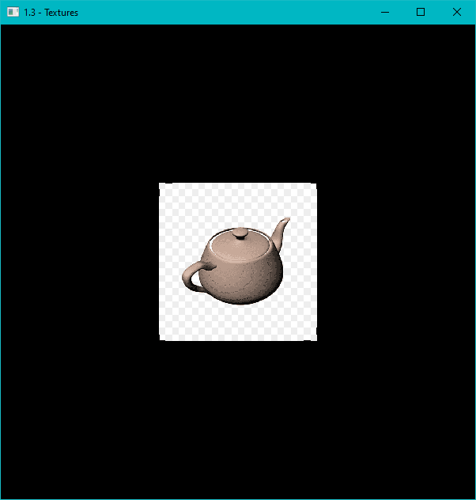

---
{
    "TableOfContents": {
        "Name": "1.3 - Hello Texture",
        "Url": "3-hello-Texture.html",
        "Metadata": {
            "AuthorGitHub": "lumi2021",
            "DateTimeWritten": "11/01/2024 16:00",
            "PreviewImage": ""
        }
    }
}
---

# 1.3 - Hello Texture
<?# Info "You can view the source code for this tutorial [here](../sources/1.3-final-result.html). This tutorial builds on the previous tutorial. If you haven't read it, you can do so [here](1-hello-window.html)." /?>

After a good time of work we can finaly see what we want in the screen, but obviously we need a lot to can create a good program!

Another very important thing in graphics programming is the hability to draw images. In this tutorial, you'll learn:

* What is a texture.
* How to send more data to shaders.
* How to use texture coordinates.
* How import images as textures.
* How shaders handle images.
* How to use texture parameters.
* How to allow mipmaps.

like as before, this tutorial will feature a lot of new content and info, so we'll take it slowand good explained.

## What is a texture
Technically, textures are multidimensional objects that stores color data.

Mainly, textures store 2D data of the pixels of an image like a 2D array (this is just for comparation. Texture objects are a lot more
complex than just 2D arrays!).
This data can be used to be sanded to a shader, in an easy away for it can read.

<?# Info "there's 1D or 3D texture objects, but we will focus on 2D" /?>

But don't think texturing objects is easily as a simple drag-and-drop! Textures needs some information to can be drawned.
The most important information that we need to send to the texture to see it on the screen is the texture coordinates.
The texture coordinate are the position of the texture in the specific vertex and at first, we will learn how to create
and read it using the shader.


## Sending more data to shaders
Having it as our next objective, let's learn how to recive more data to shaders,in the way to use it as our texture coordinates.

texture coordinates are type of data that can be easly manipulated just by the vertex, so this is the way that we use to send the
coordinates.

Let's back on our `OnLoad` function. let's update our `vertices` Array to the following:
```c#
// The quad vertices data. Now with Texture coordinates!
float[] vertices =
{
//       aPosition     | aTexCoords
     0.5f,  0.5f, 0.0f,  1.0f, 1.0f,
     0.5f, -0.5f, 0.0f,  1.0f, 0.0f,
    -0.5f, -0.5f, 0.0f,  0.0f, 0.0f,
    -0.5f,  0.5f, 0.0f,  0.0f, 1.0f
};
```

In this way, we can use the same Float Array `vertices` to store both vertex and texture coordinates, easly and fast.

If we try to run our program now...


"Oh no! We messed up with everything!" is what you should be thinking. And in the reality, yes, we do. But it's simple, we just
forgot to update the vertex position atribute pointer.

In our `VertexAttribPointer`, we declarated a size of 3 and a stride of 3 for the `aPosition` atribute.
Because of this, our Buffer is being read like this:


To fix this little idsue, we just need to back to our `VertexAttribPointer()`, below our shader compiling section, and
change it to:
```c#
//                                        3 position + 2 texture coordinates! \/
_gl.VertexAttribPointer(positionLoc, 3, VertexAttribPointerType.Float, false, 5 * sizeof(float), (void*)0);
```

And if we run the program now, we can see our quad back!

## Using texture coordinates
Now, we just need to prepare the shader to recive the texture coodenate values. For that we need to modify both our shaders.

Vertex Shader:
```
#version 330 core

layout (location = 0) in vec3 aPosition;
layout (location = 1) in vec2 aTextureCoord;    // < Add it

out vec2 frag_texCoords;                        // < It
//This line stores the data that we want to be recived by the fragment

void main()
{
    gl_Position = vec4(aPosition, 1.0);
    frag_texCoords = aTextureCoord;             // < And more it
    // Remember to assigin the data!
}";
```

Fragment Shader:
```
#version 330 core

in vec2 frag_texCoords; // < Add it
// frag_texCoords come from vertex shader!

out vec4 out_color;

void main()
{
    // This will allow us to see the texture coords in action!
    out_color = vec4(frag_texCoords.x, frag_texCoords.y, 0, 1.0);
}
```

Now we just need to assigin the correct pointer to `aTextureCoord`. You should add these lines below our first atribution:

```c#
const uint texCoordLoc = 1;
_gl.EnableVertexAttribArray(texCoordLoc);
_gl.VertexAttribPointer(texCoordLoc, 2, VertexAttribPointerType.Float, false, 5 * sizeof(float), (void*)(3 * sizeof(float)));
```

Pay attention in the last parameter, the pointer! It represents the size of bytes that that should be jumped in the start of
each stride. It means GL will add 3 indexes after stride and pick the consecutive 2 values.
if you did everything right, you will see this result!


Obviously, this isn't what we want. We can't see any texture in our quad! But don'g think you're reading the wrong tutorial. in reality, what you're seeing is
the texture coordinates in action!

What it means? The colors that you see is the coordinate value of the pixel. As a way to debug it, we're converting the numeric values to color values to can see what
we are doing.In the shaeder, the values are being read like this:


The good part is: The fragment shader already interpolate the coordinates! so we don't need to send a value per pixel, just a value per
vertex. It of course saves a lot of work!

## importing images as textures
Now the best part, render the image!

To start this section, first dowload
[silk.png](https://github.com/dotnet/Silk.NET/blob/477154b99564aac9cf82426754857103fb88d2ea/examples/CSharp/OpenGL%20Tutorials/Tutorial%201.3%20-%20Textures/silk.png).
we will use this image in this tutorial!

In OpenGL, the texture data are read as bytes. Usualy, 4 bytes per pixel (Red, Green, Blue and Alpha).
The fact is: We can't just put the bytes of a .png or .jpg file! These files have a lot of unecessary and incripted data inside then!

To load a image file as a Byte Array, we will, first, need a external library. In our case, we will use StbImageSharp.

First of all, install the library using nuget or the following command:
```
dotnet add package StbImageSharp
```

After dowloaded, add the following reference on the top of your code:
```c#
using StbImageSharp;
```

On the top of you class, add a `uint` variable at the top of your class to store the ID of the texture object:
```c#
private static uint _texture;
```

Backing to your `OnLoad` method, add this line at the end of the method to create, active and bind the texture!
```c#
_texture = _gl.GenTexture();
_gl.ActiveTexture(TextureUnit.Texture0);
_gl.BindTexture(TextureTarget.Texture2D, _texture);
```

After that, we need to load the image bytes. You can do it with the following line:
```c#
// ImageResult.FromMemory reads the bytes of the .png file and return all it information!
ImageResult result = ImageResult.FromMemory(File.ReadAllBytes("silk.png"), ColorComponents.RedGreenBlueAlpha);
```

Now, with the image file data, we need to put the bytes inside the texture. For it we need a pointer for our bytes, the height and width of
the texture. Nothing of it is hardcoded! You can get all this information inside `ImageResult result`!
```c#
// Define a pointer to the image data
fixed (byte* ptr = result.Data)
    // Here we use "result.Width" & "result.Height" to send the sizes of the texture to the GL
    _gl.TexImage2D(TextureTarget.Texture2D, 0, InternalFormat.Rgba, (uint)result.Width,
        (uint)result.Height, 0, PixelFormat.Rgba, PixelType.UnsignedByte, ptr);
```

You don't need to know about all these values for now! When you need, you can aways search it all in OpenGL Documentation. For now,
let's just continue with the bases!

Now, with the texture data loaded, we need to configurate the texture parameters. These is one of the most important steps, is with these
parameters that the shader know how to get the correct pixels using the texture coordinates.

For now you don't need to understand that. We will abordate it in the future. Just add these lines at the final of the code.
```c#
_gl.TextureParameter(_texture, TextureParameterName.TextureWrapS, (int) TextureWrapMode.Repeat);
_gl.TextureParameter(_texture, TextureParameterName.TextureWrapT, (int) TextureWrapMode.Repeat);
_gl.TextureParameter(_texture, TextureParameterName.TextureMinFilter, (int) TextureMinFilter.Linear);
_gl.TextureParameter(_texture, TextureParameterName.TextureMagFilter, (int) TextureMagFilter.Linear);
```

And now, we just need to unbind the texture.
```c#
_gl.BindTexture(TextureTarget.Texture2D, 0);
```

## handling texture data in shader
Now, let's finally show it on the screen!

In your fragment shader, add this `uniform` data:
```
uniform sampler2D uTexture;
```

And change this line:
```
void main()
{
//  -out_color = vec4(frag_texCoords.x, frag_texCoords.y, 0, 1.0);
    out_color = texture(uTexture, frag_texCoords);
}
```

in GLSL, textures are stored as `sampler`s. In our case, a `sampler2D` for a 2D texture.
To read the texture data, the `texture` method is used. It get the color of the texture in the
specified texture coordinates and uses the previously seted parameters and the texture object to return the correct color.

But pay attention! If you have good eyes, you noticed our texture coordinates being aways `0.0` or `1.0` It's becuase the `texture` works
with normalized values! If it already don't make sense, think in a 250x500 pixels image. If you want to get the pixel at the position
(250, 250), we need to send (1, 0.5) as the texture coordinate.

<?# Info "It means: ` 1/size * pixel_position ` to each axis!" /?>

Now, if you run the program, you will see just a black quad. It's becuase we need to bind the texture before the draw call!
If you don't do it, even if you don't unbind the texture after create it, when you try to draw another object with a texture, the last aplyed texture
will be used for this mesh.

To solve it, go to your `OnRender` method and, below the `_gl.UseProgram()` call, first active the texture slot that you will use:
```c#
_gl.ActiveTexture(TextureUnit.Texture0);
```
And after, bind the texture!
```c#
_gl.BindTexture(TextureTarget.Texture2D, _texture);
```

And now (please, the drums...), you can see the image being drawn inside the quad when you run the program!


## Texture parameters
So now, some extra content to this tutorial!

If you get curious about how the texture parameters works, let's learn it now!

First, tet's learn the structure of the command:
```c#
_gl.TextureParameter( [Texture ID] , [Parameter to change] , [Value to change] );
```

The texture Id, you already know. So, let's learn what each Parameter means!

### `TextureWrapS` & `TextureWrapT`:
`TextureWrap` is the parameter that allows you to say what the `texture` method (in fragment shader) should do with values less than 0 and
greater than 1. the `S` and `T` referes to X and Y respectively.

Let's see the most common values for these parameters:

#### `TextureWrapMode.Repeat`:
Just repeats the image without any change, like the value never got less than 0 or grater than 1.  


#### `TextureWrapMode.MirroredRepeat`:
Mirror the texture for each 1 texture coordinate unit.  


#### `TextureWrapMode.ClampToBorder`:
Returns a solid color when the coordinate ins less than 0 or greater than 1.  


#### `TextureWrapMode.ClampToEdge`:
Returns the pixel on the respective edge of the image.  


## Mipmaps

## Wrapping up
You've just completed your first Silk.NET tutorial! Here's some next steps you can take:
* Move on to the [next tutorial](2-hello-quad.html), where you'll learn how to create a GL context and display a quad on the screen.
* View the full tutorial source code on the [Silk.NET git repository](https://github.com/dotnet/Silk.NET/tree/main/examples/CSharp/OpenGL%20Tutorials/Tutorial%201.1%20-%20Hello%20Window).
* Join the [Discord server](https://discord.gg/DTHHXRt), where you can ask questions, show your stuff, and chat with everyone there.
