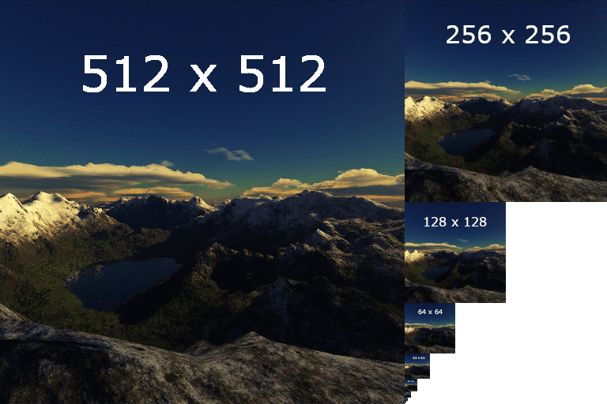

---
{
    "TableOfContents": {
        "Name": "1.3 - Hello Texture",
        "Url": "3-hello-Texture.html",
        "Metadata": {
            "AuthorGitHub": "lumi2021",
            "DateTimeWritten": "11/01/2024 16:00",
            "PreviewImage": ""
        }
    }
}
---

# 1.3 - Hello Texture
<?# Info "You can view the source code for this tutorial [here](../sources/1.3-final-result.html). This tutorial builds on the previous tutorial. If you haven't read it, you can do so [here](1-hello-window.html)." /?>

After a good time of work, we can finally see what we want on the screen, but we need a lot to create a good program!

Another very important thing in graphics programming is the ability to draw images. In this tutorial, you'll learn:

* What is a texture.
* How to send more data to shaders.
* How to use texture coordinates.
* How to import images as textures.
* How shaders handle images.
* How to use texture parameters.
* How to allow mipmaps.

Like before, this tutorial will feature a lot of new content and info, so we'll take it slow and explain.

## What is a texture
Technically, textures are multidimensional objects that store color data.

Mainly, textures store 2D data of the pixels of an image like a 2D array (this is just for comparison. Texture objects are a lot more
complex than just 2D arrays!).
This data can be used to be sanded to a shader, in an easy way for it can read.

<?# Info "There's 1D or 3D texture objects, but we will focus on 2D" /?>

But don't think texturing objects is as easy as a simple drag-and-drop! Textures need some information to be drawn.
The most important information that we need to send to the texture to see it on the screen is the texture coordinates.
The texture coordinates are the positions of the texture at a particular vertex. Below we will learn how to fill out
this data and read it from a shader.


## Sending more data to shaders
With our new objective, let's learn how to send more data to shaders, and use it as texture coordinates.

texture coordinates are a type of data that can be (and should be) manipulated by the vertex shader before be used by the fragment shader,
so this is the way that we use to send the coordinates.

Let's go back to our `OnLoad` function and update our `vertices` array to the following:
```c#
// The quad vertices data. Now with Texture coordinates!
float[] vertices =
{
//       aPosition     | aTexCoords
     0.5f,  0.5f, 0.0f,  1.0f, 1.0f,
     0.5f, -0.5f, 0.0f,  1.0f, 0.0f,
    -0.5f, -0.5f, 0.0f,  0.0f, 0.0f,
    -0.5f,  0.5f, 0.0f,  0.0f, 1.0f
};
```

With how we have structured the data, both the vertex and texture coordinates can be stored in a single array.

If we try to run our program now...


"Oh no! We messed up with everything!" is what you should be thinking. And in reality, yes, we did. But it's simple to resolve, we just
forgot to update our vertex layout definition.

In our `VertexAttribPointer` calls, we declared a size of 3 and a stride of 3 for the `aPosition` attribute.
Because of this, our buffer is being read like this:


To fix this, we just need to go back to our `VertexAttribPointer()`, which is below our shader compiling section, and
change it to:
```c#
//                                        3 position + 2 texture coordinates! \/
_gl.VertexAttribPointer(positionLoc, 3, VertexAttribPointerType.Float, false, 5 * sizeof(float), (void*)0);
```

This will make the buffer be read like that (including the texture coordinate pointer):


And if we run the program now, we can see our quad again!

## Using texture coordinates
Now, we just need to prepare the shader to receive the texture coordinate values. For that, we need to modify both our shaders.

Vertex Shader:
```
#version 330 core

layout (location = 0) in vec3 aPosition;
layout (location = 1) in vec2 aTextureCoord;    // < Add this

//This line stores the data that we want to be received by the fragment
out vec2 frag_texCoords;                        // < This

void main()
{
    gl_Position = vec4(aPosition, 1.0);
    frag_texCoords = aTextureCoord;             // < And this too
    // Remember to assigin the data!
}";
```

Fragment Shader:
```
#version 330 core

// frag_texCoords comes from vertex shader!
in vec2 frag_texCoords; // < Add this

out vec4 out_color;

void main()
{
    // This will allow us to see the texture coordinates in action!
    out_color = vec4(frag_texCoords.x, frag_texCoords.y, 0, 1.0);
}
```

Now we just need to assign the correct layout for `aTextureCoord`. You should add these lines below our first `VertexAttribPointer` call:

```c#
const uint texCoordLoc = 1;
_gl.EnableVertexAttribArray(texCoordLoc);
_gl.VertexAttribPointer(texCoordLoc, 2, VertexAttribPointerType.Float, false, 5 * sizeof(float), (void*)(3 * sizeof(float)));
```

Pay attention to the last parameter, the pointer! It represents the size of bytes that should be jumped at the start of
each stride. It means GL will add 3 indexes after stride and pick the consecutive 2 values.
if you do everything right, you will see this result!


But we aren't there just yet. We can't see any texture in our quad!
What you are seeing is the texture coordinates we passed displayed as a color!

What does this mean? The colors that you see are the texture coordinate values of that pixel. As a way to demonstrate it, we're converting
the numeric values to color values to see what we are doing. In the shader, the values are being read like this:


The neat part is that the fragment shader already interpolates the coordinates! So we don't need to do that ourselves, and can just send a value per
vertex. It saves a lot of work on our end!

## Importing images as textures
Now for the fun part: rendering an image!

To start this section, first download
[silk.png](https://github.com/dotnet/Silk.NET/blob/477154b99564aac9cf82426754857103fb88d2ea/examples/CSharp/OpenGL%20Tutorials/Tutorial%201.3%20-%20Textures/silk.png).
We will use this image in this tutorial!

In most cases with OpenGL, textures are uploaded as a sequence of bytes, this is usually done with a layout of 4 bytes per pixel (Red, Green, Blue, and Alpha).
The hard part is: we can't just upload the bytes of a .png or .jpg file! These formats have a lot of unnecessary data, like headers and most importantly
compression, which the GPU generally cannot understand.

To load an image file as a byte array, we will first need a external library. In our case, we will use StbImageSharp.

First of all, install the library using NuGet. To do so, run the following command:
```
dotnet add package StbImageSharp
```

After installing, add the following reference on the top of your code file:
```c#
using StbImageSharp;
```

At the top of your class, declare a `uint` to store the ID of the OpenGL texture object:
```c#
private static uint _texture;
```

Returning to your `OnLoad` method, add this line at the end of the method to create, and bind the texture.
That `ActiveTexture` call is telling OpenGL that we are wanting to use the first texture slot.
```c#
_texture = _gl.GenTexture();
_gl.ActiveTexture(TextureUnit.Texture0);
_gl.BindTexture(TextureTarget.Texture2D, _texture);
```

After that, we need to load the image. You can do it with the following line:
```c#
// ImageResult.FromMemory reads the bytes of the .png file and returns all its information!
ImageResult result = ImageResult.FromMemory(File.ReadAllBytes("silk.png"), ColorComponents.RedGreenBlueAlpha);
```

Now, with the image in memory, we need to upload the data to the GPU texture. To dot hat, we need a pointer for our bytes, the width, and the height of
the texture. None of it is hardcoded, you get all this information inside `ImageResult`.
```c#
// Define a pointer to the image data
fixed (byte* ptr = result.Data)
    // Here we use "result.Width" and "result.Height" to tell OpenGL about how big our texture is.
    _gl.TexImage2D(TextureTarget.Texture2D, 0, InternalFormat.Rgba, (uint)result.Width,
        (uint)result.Height, 0, PixelFormat.Rgba, PixelType.UnsignedByte, ptr);
```

You don't need to understand what all these values mean! The OpenGL documentation explains it all in depth. Right now
let's just continue with the basics!

Now, with the texture data sent off to the GPU, we need to configure the texture parameters. This is one of the most important steps. It is with these
parameters that the shader knows how to sample colors from the texture using our provided texture coordinates.

For now, you don't need to understand what these do. We will elaborate on it in the future. Just add these lines after you upload the texture data.
```c#
_gl.TextureParameter(_texture, TextureParameterName.TextureWrapS, (int) TextureWrapMode.Repeat);
_gl.TextureParameter(_texture, TextureParameterName.TextureWrapT, (int) TextureWrapMode.Repeat);
_gl.TextureParameter(_texture, TextureParameterName.TextureMinFilter, (int) TextureMinFilter.Linear);
_gl.TextureParameter(_texture, TextureParameterName.TextureMagFilter, (int) TextureMagFilter.Linear);
```

And now, we just need to unbind the texture.
```c#
_gl.BindTexture(TextureTarget.Texture2D, 0);
```

## Handling texture data in shader
Now, let's finally show it on the screen!

In your fragment shader, add this `uniform` declaration:
```
uniform sampler2D uTexture;
```

And change this line:
```
void main()
{
//  -out_color = vec4(frag_texCoords.x, frag_texCoords.y, 0, 1.0);
    out_color = texture(uTexture, frag_texCoords);
}
```

In GLSL, you usually dont work with textures directly. The most common way to access a texture is using a `sampler`.
In our case, we are using `sampler2D` for our 2D texture.
To read the texture data, the `texture` method is used. It samples the color of the texture at the
specified texture coordinates and uses the previously set parameters to interpolate that color.

But pay attention! If you have good eyes, you noticed our texture coordinates are between the ranges of `0.0` to `1.0` This is because the `texture` method works
with normalized values! If you dont understand, think about a 250x500 pixels image. If you want to get the pixel at the position
(250, 250), we need to send (1, 0.5) as the texture coordinate. You can derive the pixel coordinate from the normalized coordinate by multiplying by the axis' size.

<?# Info "You can use the equation ` 1/size * pixel_position ` to get the normalized coordinate for a particlar axis!" /?>

Now, if you run the program, you will see just a black quad. It's because we need to bind the texture before the draw call!
If you don't do it, the last applied texture will be used for this mesh, in our case, since we have no texture bound, no texture is used.

To solve it, go to your `OnRender` method and, below the `_gl.UseProgram()` call, first activate the texture slot that you will use:
```c#
_gl.ActiveTexture(TextureUnit.Texture0);
```
And after, bind the texture!
```c#
_gl.BindTexture(TextureTarget.Texture2D, _texture);
```

And now when you run it (drumroll...), you can see the image being drawn inside the quad!


## Texture parameters
And now, some extra content to go with this tutorial!

If you get curious about how the texture parameters work, let's learn it now!

First, let's learn the structure of the command:
```c#
_gl.TextureParameter( [Texture ID] , [Parameter to change] , [Value to change] );
```

The texture ID you already know. So let's learn what each parameter means!

### `TextureWrapS` & `TextureWrapT`:
`TextureWrap` is the parameter that allows you to say what the `texture` method (in the fragment shader) should do with values less than 0 and
greater than 1. The `S` and `T` refer to X and Y respectively.

Let's see the most common values for these parameters:

#### `TextureWrapMode.Repeat`:
Just repeats the image without any change, like the value never got less than 0 or greater than 1.  


#### `TextureWrapMode.MirroredRepeat`:
Mirror the texture for each 1 texture coordinate unit.  


#### `TextureWrapMode.ClampToBorder`:
Returns a solid color when the coordinate is less than 0 or greater than 1.  


#### `TextureWrapMode.ClampToEdge`:
Returns the pixel on the respective edge of the image.  


### `TextureMinFilter` & `TextureMagFilter`:
Texture `min` and `mag` filters are the filters used when the texture's final size is, respectively, less than or greater than the original size.
For now, we will show just the main two options and in the next section (Mipmaps), some others will be shown.


#### `Texture(Min/Mag)Filter.Linear`:
The (bi)linear filter is the best for low-quality images. When the pixels are sampled from the texture, this filter will get the color of the nearest
pixels of the pixel in the center of the texture coordinates and will return a linear interpolation of them.

This is an example from [Learn OpenGL](https://learnopengl.com/Getting-started/Textures). See how the neighbor colors are interpolated to return a different
color:


#### `Texture(Min/Mag)Filter.Nearest`:
The nearest filter returns the color of the center of the nearest pixel, no interpolation is done.


## Mipmaps
Now for the last part of this tutorial. Mipmaps are an essential resource for making good renders.

But first, what are Mipmaps?

Mipmaps are a map of tiny versions of the texture. The following is an example of mipmap texture:


But what is this used for?

At first look, mipmaps may seem very useless. But in reality, they are extremely important! Mipmaps are used when the texture is being rendered at a very low size,
which can cause some weird visual artifacts, even with the use of the linear filter. The most potent visual effect is something called the "moiré effect", which can
be tiring for the eyes, and generally look quite ugly.

The mipmap purpose is to provide an alternative to the fragment shader to use a texture closer to the appropriate size to be drawn, almost completely
eliminating the terrible moiré effect.

An example from [Wikipedia](https://en.wikipedia.org/wiki/File:Mipmap_Aliasing_Comparison.png). It's possible to notice weird patterns
generated far away in the render without mipmaps:


But if you think that generating mipmaps by hand for all your textures is really hard work, don't worry! OpenGL provides a special method to
do this for you.

Just after setting the texture parameters, try to add this line to your code:
```c#
_gl.GenerateMipmap(TextureTarget.Texture2D);
```

But this is not everything, we also need to set some parameters to tell the sampler to use the mipmaps:

### `GL_NEAREST_MIPMAP_NEAREST`, `GL_LINEAR_MIPMAP_NEAREST`, `GL_NEAREST_MIPMAP_LINEAR` & `GL_LINEAR_MIPMAP_LINEAR`:
These parameters should be used as the Texture Min filter and only with textures that have a mipmap.

#### `TextureMinFilter.GL_NEAREST_MIPMAP_NEAREST`:
Will get the mip with the closest size of the final image and will return the color of the pixel that matches exactly with the texture coordinates.

#### `TextureMinFilter.GL_LINEAR_MIPMAP_NEAREST`:
Will get the color of the pixels that match exactly with the texture coordinates of each mipmap and interpolates them.

#### `TextureMinFilter.GL_NEAREST_MIPMAP_LINEAR`:
Will get the mip with the closest size of the final image and will return the interpolated color
of the pixels surrounding the pixel in the texture coordinate.

#### `TextureMinFilter.GL_LINEAR_MIPMAP_LINEAR`:
Will get the interpolated color of the pixels surrounding the pixel that matches exactly with the texture coordinates of each mipmap and interpolates them.

Knowing this, you can change the parameters for:
```c#
_gl.TextureParameter(_texture, TextureParameterName.TextureWrapS, (int)TextureWrapMode.Repeat);
_gl.TextureParameter(_texture, TextureParameterName.TextureWrapT, (int)TextureWrapMode.Repeat);
_gl.TextureParameter(_texture, TextureParameterName.TextureMinFilter, (int)TextureMinFilter.NearestMipmapNearest); // <- change here!
_gl.TextureParameter(_texture, TextureParameterName.TextureMagFilter, (int)TextureMagFilter.Nearest);
```

And now the mipmaps will be used.

## Wrapping up
You've just completed another Silk.NET tutorial! Here are some next steps you can take:
* Move on to the [next tutorial](../../coming-soon.html), where we'll be abstracting away some of our code to make it easier to read.
* View the full tutorial source code on the [Silk.NET git repository](https://github.com/dotnet/Silk.NET/tree/main/examples/CSharp/OpenGL%20Tutorials/Tutorial%201.3%20-%20Textures).
* Join the [Discord server](https://discord.gg/DTHHXRt), where you can ask questions, show your stuff, and chat with everyone there.

Something not right? [Compare your code with the final result.](../sources/1.3-final-result.html)
